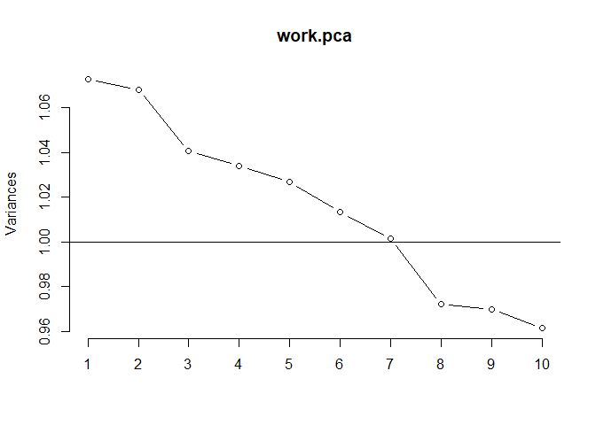

## PCA


```r
work.pca <- prcomp(work_data[,c(5,10,16:25)], center = TRUE, scale. = TRUE)

(summary(work.pca))
```

```
## Importance of components:
##                            PC1    PC2     PC3     PC4     PC5     PC6     PC7
## Standard deviation     1.03562 1.0335 1.02011 1.01687 1.01330 1.00662 1.00074
## Proportion of Variance 0.08938 0.0890 0.08672 0.08617 0.08556 0.08444 0.08346
## Cumulative Proportion  0.08938 0.1784 0.26510 0.35126 0.43683 0.52127 0.60473
##                            PC8     PC9    PC10    PC11    PC12
## Standard deviation     0.98598 0.98491 0.98054 0.96407 0.95404
## Proportion of Variance 0.08101 0.08084 0.08012 0.07745 0.07585
## Cumulative Proportion  0.68574 0.76658 0.84670 0.92415 1.00000
```

```r
screeplot(work.pca, type = "lines")
abline(1,0)
```

<!-- -->


