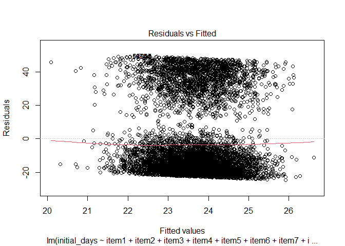
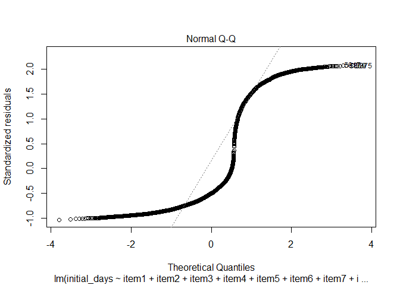
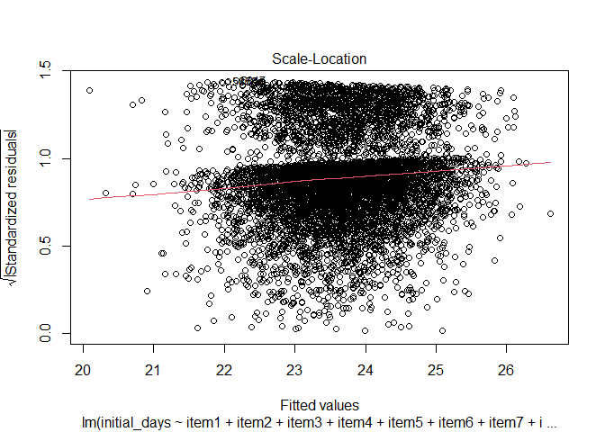
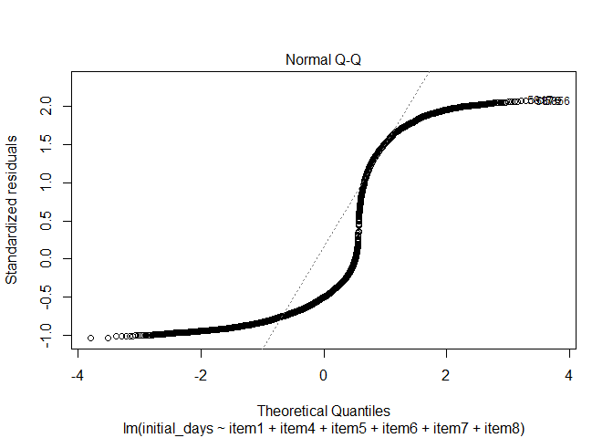
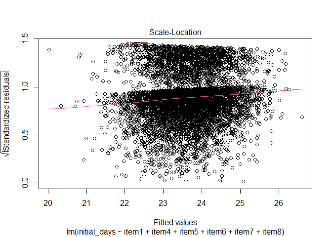

## R Markdown


```r
sample <- test[1:7000,]
```


```r
pander(fav_stats(sample$initial_days))
```


-------------------------------------------------------------------------
  min     Q1     median    Q3      max    mean     sd      n     missing 
------- ------- -------- ------- ------- ------- ------- ------ ---------
 1.002   5.759    11.8    48.87   71.97   23.66   23.83   7000      0    
-------------------------------------------------------------------------

```r
pander(fav_stats(sample$item1))
```


---------------------------------------------------------------
 min   Q1   median   Q3   max   mean     sd      n     missing 
----- ---- -------- ---- ----- ------- ------- ------ ---------
  1    3      4      4     8    3.528   1.031   7000      0    
---------------------------------------------------------------

```r
pander(fav_stats(sample$item2))
```


---------------------------------------------------------------
 min   Q1   median   Q3   max   mean     sd      n     missing 
----- ---- -------- ---- ----- ------- ------- ------ ---------
  1    3      4      4     7    3.507   1.033   7000      0    
---------------------------------------------------------------

```r
pander(fav_stats(sample$item3))
```


---------------------------------------------------------------
 min   Q1   median   Q3   max   mean     sd      n     missing 
----- ---- -------- ---- ----- ------- ------- ------ ---------
  1    3      4      4     7    3.515   1.035   7000      0    
---------------------------------------------------------------

```r
pander(fav_stats(sample$item4))
```


---------------------------------------------------------------
 min   Q1   median   Q3   max   mean     sd      n     missing 
----- ---- -------- ---- ----- ------- ------- ------ ---------
  1    3      4      4     7    3.527   1.036   7000      0    
---------------------------------------------------------------

```r
pander(fav_stats(sample$item5))
```


---------------------------------------------------------------
 min   Q1   median   Q3   max   mean     sd      n     missing 
----- ---- -------- ---- ----- ------- ------- ------ ---------
  1    3      4      4     7    3.502   1.023   7000      0    
---------------------------------------------------------------

```r
pander(fav_stats(sample$item6))
```


---------------------------------------------------------------
 min   Q1   median   Q3   max   mean     sd      n     missing 
----- ---- -------- ---- ----- ------- ------- ------ ---------
  1    3      4      4     7    3.526   1.036   7000      0    
---------------------------------------------------------------

```r
pander(fav_stats(sample$item7))
```


---------------------------------------------------------------
 min   Q1   median   Q3   max   mean     sd      n     missing 
----- ---- -------- ---- ----- ------- ------- ------ ---------
  1    3      3      4     7    3.495   1.015   7000      0    
---------------------------------------------------------------

```r
pander(fav_stats(sample$item8))
```


---------------------------------------------------------------
 min   Q1   median   Q3   max   mean     sd      n     missing 
----- ---- -------- ---- ----- ------- ------- ------ ---------
  1    3      4      4     7    3.518   1.051   7000      0    
---------------------------------------------------------------


```r
test.lm <- lm(initial_days ~ item1 + item2 + item3 + item4 + item5 + item6 + item7 + item8, data = sample)
```


```r
pander(summary(test.lm))
```


---------------------------------------------------------------
     &nbsp;        Estimate   Std. Error   t value   Pr(>|t|)  
----------------- ---------- ------------ --------- -----------
 **(Intercept)**    22.53       2.495       9.028    2.221e-19 

    **item1**      -0.7457      0.4109     -1.815     0.06959  

    **item2**      0.06812      0.3782     0.1801     0.8571   

    **item3**      -0.08225     0.3518     -0.2338    0.8151   

    **item4**      0.09799      0.3112     0.3149     0.7529   

    **item5**       0.3847      0.3291      1.169     0.2426   

    **item6**      -0.1124      0.3375     -0.333     0.7392   

    **item7**       0.4157      0.3219      1.291     0.1966   

    **item8**       0.3015      0.2973      1.014     0.3105   
---------------------------------------------------------------


----------------------------------------------------------------
 Observations   Residual Std. Error    $R^2$     Adjusted $R^2$ 
-------------- --------------------- ---------- ----------------
     7000              23.83          0.001171     2.767e-05    
----------------------------------------------------------------

Table: Fitting linear model: initial_days ~ item1 + item2 + item3 + item4 + item5 + item6 + item7 + item8

```r
plot(test.lm, which = 1:3)
```

<!-- --><!-- --><!-- -->


```r
test2.lm <- lm(initial_days ~ item1 + item4 + item5 + item6 + item7 + item8, data = sample)
```


```r
pander(summary(test2.lm))
```


---------------------------------------------------------------
     &nbsp;        Estimate   Std. Error   t value   Pr(>|t|)  
----------------- ---------- ------------ --------- -----------
 **(Intercept)**    22.48       2.465       9.12     9.635e-20 

    **item1**      -0.7501      0.3244     -2.312     0.0208   

    **item4**      0.09885      0.311      0.3179     0.7506   

    **item5**       0.3853      0.3284      1.173     0.2407   

    **item6**      -0.1118      0.3346     -0.3342    0.7382   

    **item7**       0.4159      0.3207      1.297     0.1947   

    **item8**       0.3017      0.2966      1.017      0.309   
---------------------------------------------------------------


---------------------------------------------------------------
 Observations   Residual Std. Error    $R^2$    Adjusted $R^2$ 
-------------- --------------------- --------- ----------------
     7000              23.83          0.00116     0.0003033    
---------------------------------------------------------------

Table: Fitting linear model: initial_days ~ item1 + item4 + item5 + item6 + item7 + item8

```r
plot(test2.lm, which = 1:3)
```

<!-- --><!-- --><!-- -->

$$
y = 22.48-0.7501X_{item1}+0.4159_{item7}
$$
