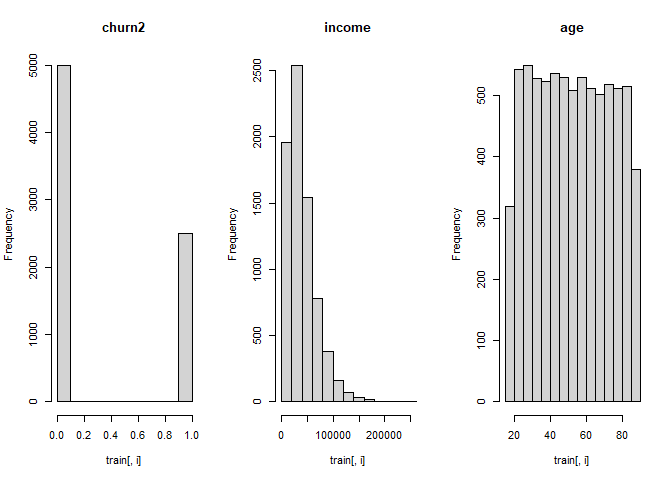
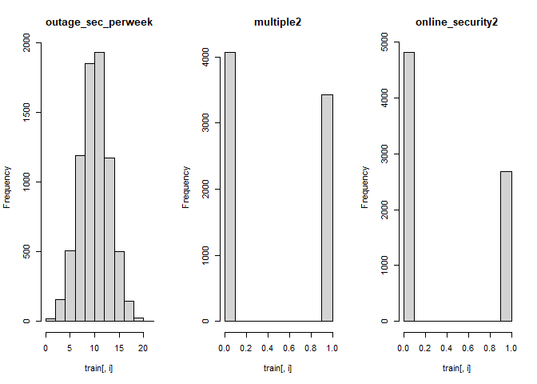
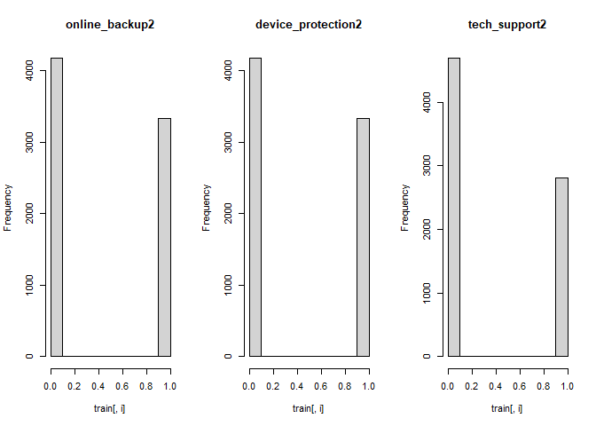
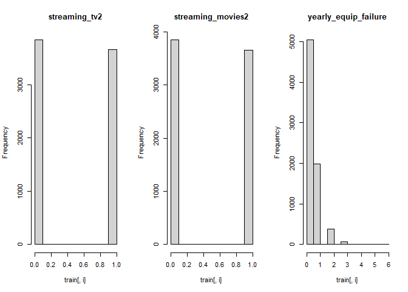
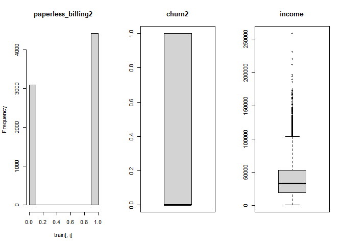
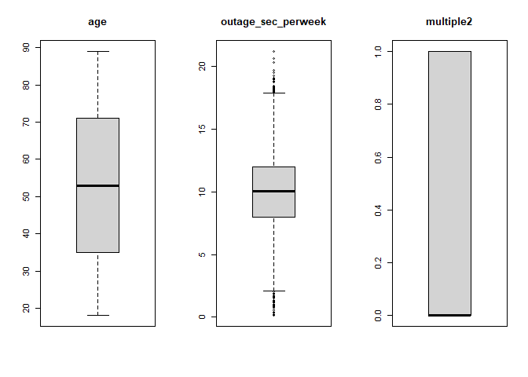
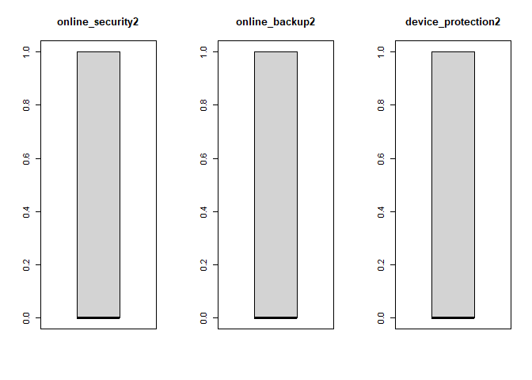
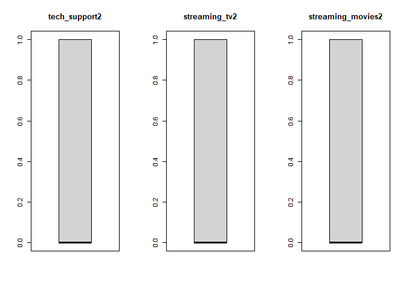
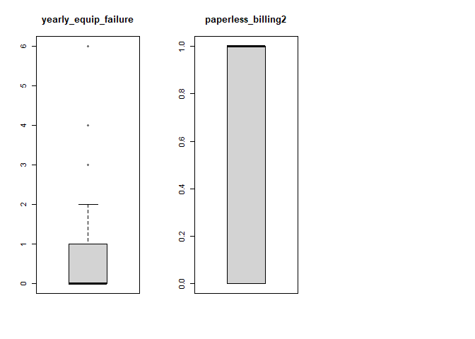
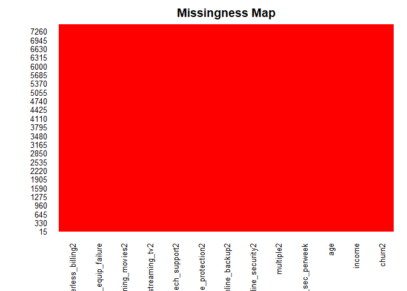

```r
pander(favstats(train$churn2))
```


-----------------------------------------------------------------
 min   Q1   median   Q3   max    mean      sd      n     missing 
----- ---- -------- ---- ----- -------- -------- ------ ---------
  0    0      0      1     1    0.3335   0.4715   7500      0    
-----------------------------------------------------------------

```r
pander(favstats(train$income))
```


--------------------------------------------------------------------------
  min     Q1     median    Q3      max     mean     sd      n     missing 
------- ------- -------- ------- -------- ------- ------- ------ ---------
 348.7   19266   33103    53160   258901   39751   28124   7500      0    
--------------------------------------------------------------------------

```r
pander(favstats(train$age))
```


---------------------------------------------------------------
 min   Q1   median   Q3   max   mean     sd      n     missing 
----- ---- -------- ---- ----- ------- ------- ------ ---------
 18    35     53     71   89    52.96   20.74   7500      0    
---------------------------------------------------------------

```r
pander(favstats(train$outage_sec_perweek))
```


--------------------------------------------------------------------------
  min      Q1     median    Q3      max    mean     sd      n     missing 
-------- ------- -------- ------- ------- ------- ------- ------ ---------
 0.1201   8.005   10.03    11.98   21.21   9.996   2.992   7500      0    
--------------------------------------------------------------------------

```r
pander(favstats(train$multiple2))
```


-----------------------------------------------------------------
 min   Q1   median   Q3   max    mean      sd      n     missing 
----- ---- -------- ---- ----- -------- -------- ------ ---------
  0    0      0      1     1    0.4576   0.4982   7500      0    
-----------------------------------------------------------------

```r
pander(favstats(train$online_security2))
```


-----------------------------------------------------------------
 min   Q1   median   Q3   max    mean      sd      n     missing 
----- ---- -------- ---- ----- -------- -------- ------ ---------
  0    0      0      1     1    0.3583   0.4795   7500      0    
-----------------------------------------------------------------

```r
pander(favstats(train$online_backup2))
```


-----------------------------------------------------------------
 min   Q1   median   Q3   max    mean      sd      n     missing 
----- ---- -------- ---- ----- -------- -------- ------ ---------
  0    0      0      1     1    0.4436   0.4968   7500      0    
-----------------------------------------------------------------

```r
pander(favstats(train$device_protection2))
```


-----------------------------------------------------------------
 min   Q1   median   Q3   max    mean      sd      n     missing 
----- ---- -------- ---- ----- -------- -------- ------ ---------
  0    0      0      1     1    0.4433   0.4968   7500      0    
-----------------------------------------------------------------

```r
pander(favstats(train$tech_support2))
```


----------------------------------------------------------------
 min   Q1   median   Q3   max    mean     sd      n     missing 
----- ---- -------- ---- ----- -------- ------- ------ ---------
  0    0      0      1     1    0.3743   0.484   7500      0    
----------------------------------------------------------------

```r
pander(favstats(train$streaming_tv2))
```


----------------------------------------------------------------
 min   Q1   median   Q3   max   mean      sd      n     missing 
----- ---- -------- ---- ----- ------- -------- ------ ---------
  0    0      0      1     1    0.488   0.4999   7500      0    
----------------------------------------------------------------

```r
pander(favstats(train$streaming_movies2))
```


-----------------------------------------------------------------
 min   Q1   median   Q3   max    mean      sd      n     missing 
----- ---- -------- ---- ----- -------- -------- ------ ---------
  0    0      0      1     1    0.4868   0.4999   7500      0    
-----------------------------------------------------------------

```r
pander(favstats(train$yearly_equip_failure))
```


-----------------------------------------------------------------
 min   Q1   median   Q3   max    mean      sd      n     missing 
----- ---- -------- ---- ----- -------- -------- ------ ---------
  0    0      0      1     6    0.3992   0.6389   7500      0    
-----------------------------------------------------------------

```r
pander(favstats(train$paperless_billing2))
```


-----------------------------------------------------------------
 min   Q1   median   Q3   max    mean      sd      n     missing 
----- ---- -------- ---- ----- -------- -------- ------ ---------
  0    0      1      1     1    0.5888   0.4921   7500      0    
-----------------------------------------------------------------

```r
par(mfrow=c(1,3))
for(i in 1:13) {
  hist(train[,i], main = names(train[i]))
}
```

<!-- --><!-- --><!-- --><!-- -->

```r
for(i in 1:13) {
  boxplot(train[,i], main = names(train[i]))
}
```

<!-- --><!-- --><!-- --><!-- -->

```r
par(mfrow = c(1,1))
```

<!-- -->

```r
missmap(train, col=c("blue", "red"), legend=FALSE)
```

<!-- -->


```r
model <- glm(churn2 ~.,family=binomial(link='logit'),data=test)

pander(summary(model))
```


-------------------------------------------------------------------------
          &nbsp;            Estimate   Std. Error   z value    Pr(>|z|)  
-------------------------- ---------- ------------ ---------- -----------
     **(Intercept)**         -9.126      0.7237      -12.61    1.863e-36 

        **income**          1.69e-06   3.189e-06     0.5301      0.596   

         **age**            0.00419     0.00456      0.9189     0.3581   

  **outage_sec_perweek**    0.02329     0.03162      0.7364     0.4615   

      **multiple2**          0.699        0.19       3.679     0.0002341 

   **online_security2**      0.2576      0.1913      1.347      0.1779   

    **online_backup2**       0.6077      0.1888      3.218     0.001291  

  **device_protection2**     0.4528      0.1884      2.403      0.01625  

    **tech_support2**       -0.01761     0.1956      -0.09      0.9283   

    **streaming_tv2**        3.271       0.3935      8.312     9.442e-17 

  **streaming_movies2**      2.976       0.3506      8.488     2.11e-17  

 **yearly_equip_failure**    0.1269      0.1435      0.8844     0.3765   

  **paperless_billing2**    -0.01514     0.1894     -0.07994    0.9363   
-------------------------------------------------------------------------


(Dispersion parameter for  binomial  family taken to be  1 )


-------------------- -----------------------------
   Null deviance:     1129.3  on 2499  degrees of 
                                freedom           

 Residual deviance:   784.4  on 2487  degrees of  
                                freedom           
-------------------- -----------------------------


```r
glm.probs <- predict(model,type = "response")
pander(glm.probs[1:5])
```


---------------------------------------------
  7501     7502      7503      7504    7505  
-------- -------- ---------- -------- -------
 0.1419   0.3004   0.004932   0.1695   0.158 
---------------------------------------------

```r
glm.pred <- ifelse(glm.probs > 0.1, "Up", "Down")

attach(test)

pander(table(glm.pred, churn2))
```


-----------------------
  &nbsp;     0      1  
---------- ------ -----
 **Down**   1902   18  

  **Up**    449    131 
-----------------------

```r
pander((131+1902)/(1902+18+449+131))
```

_0.8132_


```r
test2 <- test %>% select(churn2, multiple2, online_security2, online_backup2, device_protection2, tech_support2, streaming_tv2, streaming_movies2)

model2 <- glm(churn2 ~.,family=binomial(link='logit'),data=test2)

pander(summary(model2))
```


----------------------------------------------------------------------
         &nbsp;           Estimate   Std. Error   z value   Pr(>|z|)  
------------------------ ---------- ------------ --------- -----------
    **(Intercept)**        -8.545      0.5618     -15.21    3.064e-52 

     **multiple2**         0.6963      0.1889      3.685    0.0002284 

  **online_security2**     0.2411      0.1904      1.266     0.2054   

   **online_backup2**      0.6034      0.1882      3.206    0.001344  

 **device_protection2**    0.4657      0.1868      2.494     0.01265  

   **tech_support2**      -0.02316     0.1939     -0.1195    0.9049   

   **streaming_tv2**       3.261       0.3931      8.294    1.091e-16 

 **streaming_movies2**     2.991       0.3504      8.535    1.399e-17 
----------------------------------------------------------------------


(Dispersion parameter for  binomial  family taken to be  1 )


-------------------- -----------------------------
   Null deviance:     1129.3  on 2499  degrees of 
                                freedom           

 Residual deviance:   786.9  on 2492  degrees of  
                                freedom           
-------------------- -----------------------------


```r
glm.probs2 <- predict(model2,type = "response")
pander(glm.probs2[1:5])
```


---------------------------------------------
  7501     7502     7503      7504     7505  
-------- -------- --------- -------- --------
 0.1357   0.2439   0.00493   0.1684   0.1651 
---------------------------------------------

```r
glm.pred2 <- ifelse(glm.probs2 > 0.1, "Up", "Down")

attach(test)
```

```
## The following objects are masked from test (pos = 3):
## 
##     age, churn2, device_protection2, income, multiple2, online_backup2,
##     online_security2, outage_sec_perweek, paperless_billing2,
##     streaming_movies2, streaming_tv2, tech_support2,
##     yearly_equip_failure
```

```r
pander(table(glm.pred2, churn2))
```


-----------------------
  &nbsp;     0      1  
---------- ------ -----
 **Down**   1912   20  

  **Up**    439    129 
-----------------------

```r
pander((1912+129)/(1912+20+439+129))
```

_0.8164_

$$ y_{churn} = -8.545 + 0.6963x_{Multiple Lines} + 0.6034x_{Online Backup} + 0.4657xc_{Device Protection} + 3.261x_{Streaming TV} + 2.991x_{Streaming Movies} $$

