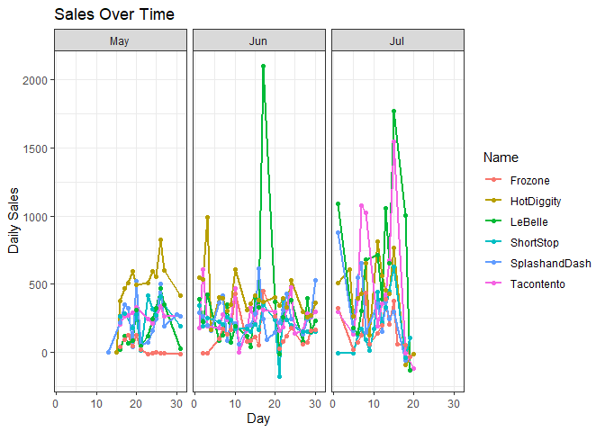
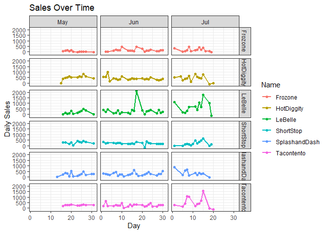
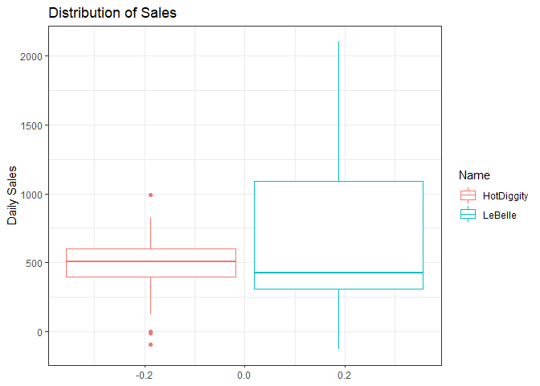

### Data Wrangling


```r
sales2.0 <- sales %>%
  with_tz(tzone = "US/Mountain") %>% 
  mutate(month = month(time, label = TRUE)
         , week = week(time)
         , day = day(time))
```

### Analysis

Initially, let's just look at how each group did during the semester in terms of sales numbers:


```r
knitr::kable(sales2.0 %>% 
               group_by(name) %>% 
               summarize("Total Sales" = n(),
                         "Total Revenue" = sum(amount)) %>% 
               filter(name != "Missing"))
```


|name          | Total Sales| Total Revenue|
|:-------------|-----------:|-------------:|
|Frozone       |        1674|       5740.53|
|HotDiggity    |        5887|      21119.05|
|LeBelle       |         634|      17089.30|
|ShortStop     |        2593|      10100.81|
|SplashandDash |         533|      13427.68|
|Tacontento    |        4333|      15264.24|

Hot Diggity over all has the highest revenue over the semester, with LeBelle and Tacontento coming in 2nd and 3rd respectively. Next, I'd like to show their daily sales over time during the weeks they are open.


```r
(plot2 <-sales2.0 %>%
   group_by(name,month, day) %>% 
   mutate(daily_sales = sum(amount)) %>%
   ungroup() %>% 
   group_by(name,week) %>% 
   mutate(weekly_sales = sum(amount)) %>%
   ungroup() %>% 
   group_by(name, month) %>% 
   mutate(montly_sales = sum(amount)) %>% 
   filter(name != "Missing", month != "Apr") %>% 
   ggplot() +
   geom_line(aes(x = day, y = daily_sales, color = name), size = 1) +
   geom_point(aes(x = day, y = daily_sales, color = name)) +
   facet_grid(col =  vars(month)) +
   theme_bw() +
   xlab("Day") +
   ylab("Daily Sales") +
   labs(title = "Sales Over Time", colour = "Name"))
```

<!-- -->

Now, this is all fine and dandy, but I think a better look at this would be by having the businesses faceted out as well:


```r
(plot3 <-sales2.0 %>%
   group_by(name,month, day) %>% 
   mutate(daily_sales = sum(amount)) %>%
   ungroup() %>% 
   group_by(name,week) %>% 
   mutate(weekly_sales = sum(amount)) %>%
   ungroup() %>% 
   group_by(name, month) %>% 
   mutate(montly_sales = sum(amount)) %>% 
   filter(name != "Missing", month != "Apr") %>% 
   ggplot() +
   geom_line(aes(x = day, y = daily_sales, color = name), size = 1) +
   geom_point(aes(x = day, y = daily_sales, color = name)) +
   facet_grid(rows = vars(name), col =  vars(month)) +
   theme_bw() +
   xlab("Day") +
   ylab("Daily Sales") +
   labs(title = "Sales Over Time", colour = "Name"))
```

<!-- -->

That's better. From here, it's easy to see that Hot Diggity has some of the most regular sales, but LeBelle has the two highest days and does incredibly well in the month of July. So dialing in on one business to invest in, I'm going to focus on those two.


```r
sales3.0 <- sales2.0 %>% 
  filter(name %in% c("HotDiggity", "LeBelle"))

(plot4 <- sales3.0 %>% 
  group_by(name,month, day) %>% 
  mutate(daily_sales = sum(amount)) %>%
  ungroup() %>% 
  group_by(name,week) %>% 
  mutate(weekly_sales = sum(amount)) %>%
  ungroup() %>% 
  group_by(name, month) %>% 
  mutate(montly_sales = sum(amount)) %>% 
  filter(name != "Missing", month != "Apr") %>% 
  ggplot() +
  geom_boxplot(aes(y = daily_sales, color = name)) +
  theme_bw() +
  ylab("Daily Sales") +
  labs(title = "Distribution of Sales", colour = "Name"))
```

<!-- -->

As you can see, HotDiggity has a higher average daily sales. So, although LeBelle has a high max, they also have a lower min, and this drives my decision to recommend HotDiggity for out investment to go into.
